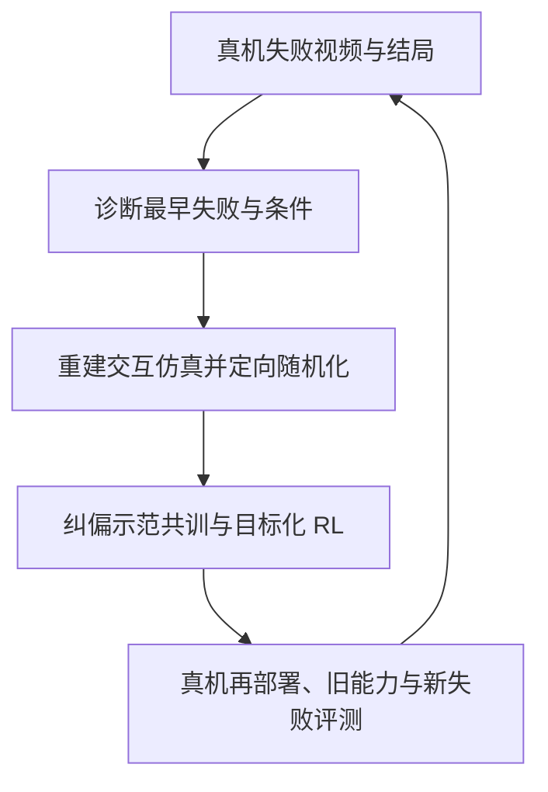

# F4R：从真实失败定位到仿真再训练的闭环

> [论文 v2，2026-09-29](https://arxiv.org/html/2609.35575v2)（v1 09-28） · 2026-09-30 专题阅读。核对方法、主表、预算附录与限制；未重建作者仿真场景、未复现模型训练或真机结果。

## 一句话与直白解释

F4R 发现真机失败后，识别最早的失败环节，把该问题变成可交互的物体中心仿真环境，再在其周围生成纠偏示范、定向 RL，重新部署并继续收集失败。

直白地说：机器人没把碗叠稳，下一轮不必平均多练所有厨房情形。先查明是碗的姿态、抓取还是接触滑落，复现这种失败附近的初始条件，在仿真里集中练，把旧真实数据混入以防忘记，再回到真机检查是否解决、有没有新问题。

## 四段闭环：数据从哪里来、哪些参数在更新

1. **Recognize：**成功判定器先挑失败轨迹；诊断器根据外部/腕部同步视频，定位最早失败阶段和可能原因，导出物体摆放、摩擦、接触或遮挡等仿真随机化变量。诊断错误会把训练引向错误区域。
2. **Reconstruct：**恢复任务有关的场景/物体几何与条件，形成物体中心的可交互环境；围绕失败条件作局部随机化 `p_F`。仿真 fidelity 尤其接触摩擦仍可能不足。
3. **Refine：**先从既有成功真机轨迹生成失败条件下的模拟纠偏示范，做**原真实数据 + 目标模拟数据**的 SFT 共训；再在 `p_F` 中用 PPO 和**原始任务奖励**做 RL，并加旧真实数据 SFT 辅助项防遗忘。这里**策略权重发生更新**，不能归类为只读外部 memory 的 test-time 方法。
4. **Redeploy：**回真机测试旧任务与新失败；新发现的失败进入下一轮环境重建和训练。论文的闭环已做多轮示范，但有人负责硬件安全停止；“无人工纠错示范”不等于“完全无人看守”。

## 作者结果、成本与限制

- 作者在四项真机桌面任务报告 ID 平均 **93.75%**、失败条件分布 OOD 平均 **90.0%**；同表 Targeted BC OOD **71.25%**，RLinf-Co **77.5%**。比较配对的是数据准备的壁钟预算，**不等于总人力、场景构建、GPU 训练时间全部相等**；附录列出训练约 10–14 小时（对照另有 15 小时）与可复用场景资产。
- 消融尤其值得读：**不做共训 SFT、只做目标 RL** 时 OOD 32.5%；只做共训、不做 RL 时 OOD 83.75%；两者结合 90.0%。说明纠偏示范为稀疏奖励探索提供了主要起点，随后 RL 有额外收益；不能把 26.25→90 全部归功于 RL。
- 80 条人工标注失败轨迹上，一次诊断正确 69/80（86.25%），两次以内 74/80（92.5%）；但这不保证其他视觉变化/任务也有该准确率。附录显示透明反光物、关节机构、接触摩擦差异和形变场景仍难重建；主验证集中在桌面刚体操作。
- 多轮结果之一：Stack Bowls 从 30% 依次至 80%、90%、95%；另一个跨任务保留实验中 Cup-on-Coaster 第一轮曾从 60% **下降至 50%**，下一轮才恢复到 90%。要报告旧技能退化，不能只展示最终均值。

## 与 RLT 工程主线的关系

- 对“机器人经历失败—形成下一轮训练数据—RL 改进—再部署”的系统故事，F4R 是**直接近邻**；单独主张失败驱动闭环、目标化 RL 或 real-to-sim-to-real 新颖性站不住。
- 我们当前 ManiSkill `PegInsertionSide` RLT baseline 尚在 Stage 2，FLARE/Zeva/Jev 分支也没有闭环成功收益证明。F4R 依赖可编辑的物体中心仿真、任务成功判定、失败诊断与模拟纠偏数据；**目前不建议为了借这篇而先构建整套场景重建系统**。
- 可先借的最小方案：在**现有仿真**中把失败按最早可观测阶段分组，如未对准/接触偏移/卡住/抓取失败；同样环境步数与 actor update 下比较 `uniform reset`、`random failure reset`、`diagnosed failure-neighborhood reset`。保持原奖励、参考动作/专家门控、起始权重相同，另报告旧初始化成功率、关键失败条件成功率与接管时长。若失败定位需 simulator privileged 标签，只作为**训练期 reset 构造**，不能宣称部署期无标注自主诊断。
- 与现有 Zeva 快记忆、FLARE 后果 loss 分离：F4R 改的是**采样分布和训练资产**，记忆方法改的是决策可用历史，loss-first 改的是表示监督。单独做好失败分组 ablation 后再讨论组合。

## 原始来源

- [arXiv v2 正文与附录](https://arxiv.org/html/2609.35575v2)：§3.2–3.5、§4.2/4.6/4.7、S5–S6；[论文 PDF v2](https://arxiv.org/pdf/2609.35575v2)。
