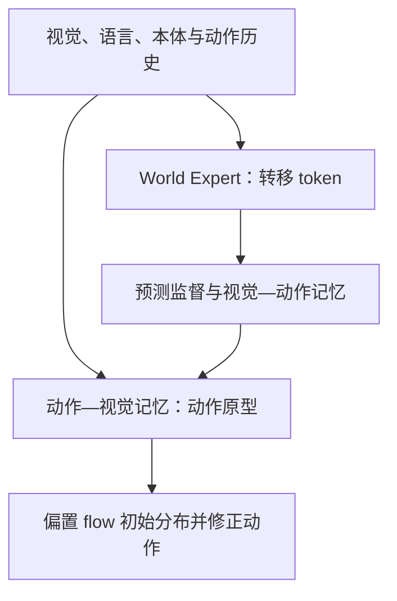

# UniMPA：以动作落地的状态转移连接预测、记忆与动作

> [论文 v1，2026-09-10](https://arxiv.org/html/2609.11875v1) · [作者项目页](https://jiutian-vl.github.io/UniMPA-page/) · 2026-09-30 专题阅读。阅读范围：方法、实验、消融、附录的推理路径与限制；未复现代码、训练或机器人结果。论文备注为 **submitted to TPAMI**，不是已接收。

## 一句话与直白解释

UniMPA 不仅预测“下一幅画面可能长什么样”，还利用视觉—动作历史检查预期变化有没有对应的可执行经验，再把检索出的动作原型调整为当前场景可用的动作。

直白地说：看见零件应当被插入，不能直接照搬旧场景的插入动作；系统先表征想发生的变化，在旧经验中寻找真正做出过类似变化的动作，再根据当前姿态修正。作者把“预期结果、做得成的历史动作、当前动作生成”接到同一转移接口。

## 问题、框架与训练

作者称三个缺口：相似当前图像可能属于不同操作阶段；预测画面合理不代表机器臂可做到；旧动作在新物体位姿下不能直接复制。框架如下（各箭头是论文方法，非我们已实现的接口）：

1. **记忆预训练：**用未来重建、模拟检索和视觉—动作时间配对，预训练双向 memory bank；条目保留 episode 与时间索引，以期望转移检索历史可执行轨迹。
2. **策略阶段：**在 π0.5 基座上加入 World Expert，持续施加未来 latent 监督；仅在视觉 latent 变化或平移、旋转、夹爪变化达到触发条件时解码未来像素。训练动作的 flow matching、latent 与选择性像素损失，记忆库在这一阶段冻结。
3. **动作原型：**用近期动作历史检索 Action–Visual Bank；原型偏置 Gaussian flow source，Action Expert 继续结合当前视觉、语言、本体修正，而非直接拷贝动作。
4. **推理边界：**未来 latent/pixel **解码头关闭**，但 World Expert 转移 token、Action–Visual Bank 和动作生成仍在推理路径；视觉—动作检索对像素监督的路径不在部署中运行。不能称推理时“生成未来图再给策略”。附录给出 16 个转移 query、18 层 World Expert，这是该实现的结构参数，并非通用 physical token 定义。

## 作者结果与能证明到哪里

作者报告 LIBERO 98.6% 平均成功率、LIBERO-Plus 85.3%；论文称在 RoboTwin 2.0 Hard 和真机上相对 π0.5 也有提升。消融中，直接复制近邻动作低于“检索原型 + flow 修正”；单用 latent、单用像素或密集像素监督也低于持续 latent 加关键时刻像素监督。这些比较支持各模块在作者训练/评测合同下的作用，**不直接证明在线 RL 更快收敛**。关于只用 π0.5 的 25–50% 训练 epoch 的叙述，也不等于严格相同 GPU 时间或模块参数预算。

## 与 RLT 的重合与真正可试的窄问题

- 高度重合的已知部分：**未来表征监督**与现有 FLARE 启发分支重叠；**转移对应的经验检索**与 Zeva 分支重叠；**经验约束动作原型**与 Jev/有限候选方向相邻。因此不能把三者放在一起就命名为新的“预测—记忆—动作统一框架”。
- 当前 RLT 尚未有 UniMPA 的 World Expert + 双向预训练 memory bank + flow source 偏置；在线 learner 读取 frozen `z_RLT` 并与少量 replay 交互，属于不同计算与更新合同。**不要**宣称我们已复现或优于 UniMPA。
- 值得试的低成本问题：在相同未来标签、历史长度和 learner 容量下，**仅在已经完成的实际接触转移上**提供一个有来源和支持度的响应证据，能否比短历史、近邻动作复制和同幅度 residual 更快使 RLT 的决策改善？先做数据可用性与负迁移审计，之后才动在线策略。
- 重要创新边界：附录已明确提出“跨 rollout 异步扩充记忆”为可用机制，并把**同一 rollout 内同步更新记忆**及自适应多时域预测列为未来方向。不能把“在线增量加记忆”概念本身当作独占创新；需要明确实际执行数据、记忆时序、更新门控、对照与有效控制证据。

## 读论文时必须追问

1. 未来标签是训练期监督，部署是否仍有未来画面解码？答案：没有解码，但保留 World Expert。
2. 新经验何时进库？论文的部署扩展允许**完成一次 rollout 后**异步建库；在当前 rollout 内即时写入是作者提出的未来工作，不能混说。
3. 检索提升来自真实转移匹配，还是参数量、额外未来标签、预训练数据及大模型联合训练？这需要与等预算的简单近邻和 RLT 原始 history 比较。

## 原始来源

- [arXiv v1 正文与附录](https://arxiv.org/html/2609.11875v1)：§III-B–D、§IV-E、Appendix G；[论文 PDF](https://arxiv.org/pdf/2609.11875)。
- [作者项目页](https://jiutian-vl.github.io/UniMPA-page/)：架构、两阶段训练与视频。本站未核验到可运行的正式代码 release；不写“代码已复现”。
