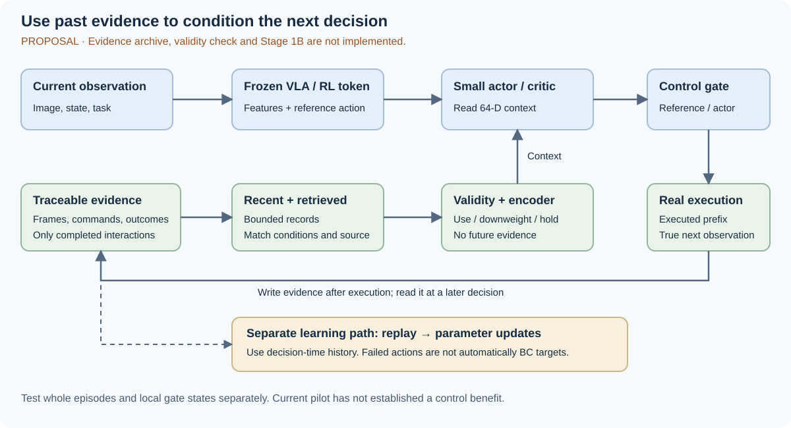

# 从记住历史到可靠使用经验：MEM、LT-Mem、VISTA 对 Zeva–RLT 的启发

这份笔记核查三项记忆工作，并把可借鉴的机制接到当前 Zeva–RLT 实验。**核查日期：2026-10-06。论文结果属于原作者；后半部分是本项目的待测设计。本次没有新增 GPU 实验。**

[当前方法](../zeva-rlt-implementation-2026-09-26.md) · [本地控制证据](../progress-2026-10-04.md) · [论文阅读账本](reading-ledger.md)

## 先明确要解决的问题

当前主线可以更具体：**机器人保留已经完成的动作及其后果，判断这些经验是否仍适用于当前条件，再给小 actor／critic 提供条件。检验它能否减少重复失败和达到同等成功率所需的纠错。**

这里有三个不同问题。近期历史补充当前看不到的信息。长期记录保存跨尝试可用的经验。有效性判断处理环境变化后的旧经验。把三者放进一个网络，并不自动产生控制收益。

| 工作 | 原文解决什么 | 我们借鉴什么 | 不能据此声称什么 |
|---|---|---|---|
| MEM | 长任务进度与近期操作信息需要不同粒度 | 近期细节与长期事件分开读取 | 冻结 RLT 已能直接复现 MEM；记忆已减少 RL 干预 |
| LT-Mem | 多次观察中，物体身份与状态会变化 | 先核对经验适用对象和条件，再决定更新、保留或暂缓 | 场景记忆实验已证明接触控制或物理规律迁移 |
| VISTA | 压缩上下文后仍需查看原始视觉证据 | 紧凑条件之外保留证据索引，允许回查 | 只加一个 memory token 就把机器人能力提升到“100 分” |
| RECAP／HIL-SERL | 如何用自主经验、示范和纠正改进控制 | 明确经验质量、纠错来源和训练成本 | 存储失败就等于会从失败中学到正确动作 |

上述机制已有充分先例。论文贡献不能写成“首次加入长短期记忆”。更值得检验的是：**在冻结视觉先验和有限纠错预算下，怎样选择仍然适用的动作—后果经验，并证明选择机制有控制价值。** 这仍是研究假设。

## MEM：短期操作细节与长期任务进度分开

Physical Intelligence 的 [MEM 原文](https://arxiv.org/html/2603.03596v1)将短期视频／本体历史与长期语言摘要组合。低层根据近期观察执行动作；高层根据任务进度生成子任务，并更新摘要。视频编码器压缩时间信息，减少传给 VLM 的历史 token。

原文包含近期失败后的动作调整实验，也包含分钟级长任务。其视频注意力结构和训练流程均有变化；“不增加新的可学习参数”不等于“无需训练”。这不是可直接插入冻结 RLT 的现成模块。

一个重要区别是：任务进度摘要可以压缩重复失败，但动作后果库应保留有信息的失败。前者记录“任务做到哪里”，后者记录“这个命令实际产生什么”。成功标志不能代替执行后果。

**本项目的取舍：**先复用冻结特征与真实动作记录。近期保留细节，长期保留有证据索引的事件。首版使用结构化字段，不增加在线语言摘要器或重训视频 VLA。是否需要语言记忆，要由任务是否需要长期语义进度决定。

## LT-Mem：更新记忆前，先判断变化是否可信

用户提供的 IROS 工作对应 [LT-Mem 原文](https://arxiv.org/html/2608.19059v1)。[作者实验室新闻](https://team-aprl.github.io/news.html)宣布获得 IROS 2026 Best Paper Award；[项目页](https://lt-mem.github.io/)仍显示 finalist，代码链接标记为 TBD。奖项信息来自作者实验室，不据此认定代码已开放可复现。

LT-Mem 在多次场景观察间维护物体身份，以变化频率和证据决定覆盖、暂缓或保留多种解释。Live、Delta、Meta 分别保存当前状态、变化事件与变化属性。论文明确把这个结构视为更新规则的结果，而非单独的架构贡献。

原文受控场景的事件 F1 为 0.910；去掉身份重识别为 0.140，去掉变化感知为 0.615。这是场景事件识别，**不是机器人操作成功率**。其会话对齐保护在报告实验中未被触发，不能说该实验验证了严重对齐失败下的恢复。

**本项目的取舍：**相似关节位置不保证相同物体、接触状态或控制条件。旧经验先核对适用条件，再参与统计。证据冲突时先降权或暂缓使用；不能把一次失败当成物理条件已经改变，也不能删除全部失败记录。

## VISTA：紧凑摘要之外，保留可回查的视觉证据

何恺明参与的工作是 [VISTA](https://arxiv.org/html/2610.02200v1)，一个围绕现有模型的视觉交互接口。它保存原始返回帧，提供历史图像查看、裁剪和像素读取，并区分通用规则笔记与当前任务笔记。[作者项目页](https://vista-research.github.io/)提供系统说明。

“40.68 到 100”是公开 ARC-AGI-3 的 RHAE 分数比较，涉及输入形式、推理设置、接口和预算变化。它不是单变量记忆消融，更不是机器人成功率。原文同接口渐进实验中，增加视觉记忆与查看工具时，也改变了自动提供图像的方式。作者还说明，公开游戏是否进入模型训练数据无法排除。见原文第 4.3、6 节及附录 A.1–A.2。

**本项目的取舍：**64 维条件用于快速控制，原始证据用于回查、重新编码和审计。先保存动作块端点的图像索引、实际命令和真实后继；这是端点证据存档，不能称为 VISTA 式全帧无损记忆。图片存下来也不等于 policy 用到了它，仍需检索与闭环对照。

## Sergey Levine：把记忆与学习闭环接起来

后续展开见 [Levine VLA＋RL 23 项专题](sergey-levine-vla-rl-2026-10-06.md)：MEM 的训练细节、RECAP、SVM、ARLI、RLDG 与三个可执行对照。此处保留原有记忆适用范围分析。

[Levine 的原始访谈](https://www.developing.dev/p/sergey-levine-current-state-of-humanoid)强调多样经验与新环境中的学习能力。这里把访谈作为研究动机，把论文作为机制与实验证据，避免用观点替代验证。

| 阅读对象 | 与当前研究最相关的内容 | 对本项目的约束 |
|---|---|---|
| [RECAP／π*0.6](https://arxiv.org/html/2511.14759v1)，2025 | 联合示范、自主成功／失败和纠正数据，用价值估计及 advantage 条件提取更好行为 | 失败可用于学习，但不应无差别作为正确 BC 标签。该方法更新 VLA，与冻结 RLT 不同。 |
| [HIL-SERL](https://hil-serl.github.io/)，2025 | 在线纠正、示范 replay 和奖励构成实际学习系统 | expert 必须能从 learner 偏离状态恢复；报告接管成本与无辅助成功率。 |
| [Flow Reversal Steering](https://flow-reversal-steering.github.io/)，2026-06 | 粗粒度人类／VLM 引导可用于引导生成动作，并形成后续学习数据 | 是降低纠正接口负担的候选。其噪声空间学习路线不同于现有 RLT，不在首轮同时替换算法。 |
| [MEM](https://arxiv.org/abs/2603.03596)，2026-03 | 历史观察支持任务进度和近期失败适应 | 记忆改变输入；RL 改变参数。实验必须分离两者。 |
| [RLPD](https://proceedings.mlr.press/v202/ball23a.html)，2023，基础参照 | 离线数据如何与在线 off-policy 学习结合 | replay 与 critic 稳定性先验收。它是基础工作，不标为最新成果。 |

RECAP 的部分任务只使用自主 rollout，并非所有任务都需要在线纠正；这不等于所有任务已不需要人。仿真阶段可先使用经过恢复验收的脚本 expert。它测量的是替代纠错成本，真人操作时间仍需另外验证。

持续跟踪时，优先查看 [PI 官方研究更新](https://www.pi.website/blog)、[Levine 主页](https://people.eecs.berkeley.edu/~svlevine/)及论文项目页。每轮开发记录日期、版本、代码可用性和与本项目的关系。本次完成的是截至 10-06 的核查，未建立无人值守定时抓取任务。

## 当前代码距离这个方向有多远

本次核对 `UPT_zeva_dev` 的 `4d93ae6a`。以下是实现事实，不是拟议设计。

| 位置／接口 | 现在的行为 | 对研究结论的限制 |
|---|---|---|
| `rlinf/algorithms/rlt/interaction_memory.py` 的 `append_completed` | 写入实际执行前缀、原始 qpos 变化及结束标志；单条 110 维 | 没有直接记录接触力、物体身份或视觉后果。 |
| `snapshot` | 4 条近期记录，再从容量 32 的 archive 中取 4 条旧记录；按原始关节位置均方距离排序 | 检索并不判断视觉／接触相似性。 |
| `begin_attempt` | 普通新尝试清空；显式同实例重试才允许保留 archive | 已有保留机制不等于已证明跨尝试收益。 |
| 固定响应 reader | 7 个响应斜率和 7 个支持度，补齐为 64 维 | 支持度不是经过校准的经验可信度；没有条件变化检测。 |
| actor 路由 | 现有配置仅在关键阶段使用小 actor | 发生在 reference 阶段的失败，不能由这个局部条件直接修复。 |

[10-04 冻结复评](../progress-2026-10-04.md)：零 context 为 16/64，响应记忆为 15/64，响应模型关闭历史为 18/64，reference 为 19/64。只有 26/64 回合到达 actor 接管阶段。四个评估 seed 来自同一个训练 seed；它们不是四次独立训练。

因此，当前证据支持“历史改变了部分动作”，尚不支持“历史提高了控制收益”。不能用新论文的正结果覆盖这个本地负结果。

## 拟议方法：保留证据，形成条件，检查适用范围

下面的图是待测设计。现有 110 维记录、replay 和小 actor／critic 是起点；图中视觉证据、有效性判断与 Stage 1B 尚未接入。

### 一条记录先说明“发生了什么”

保留 `(起始观测索引、实际命令前缀、真实后继索引、有效位、任务结果、来源)`。来源至少说明时间、attempt、控制模式和执行者。接触／碰撞标签仅在传感或仿真接口确实提供时记录；不能由位移小直接断言碰撞。

近期窗口沿用已有 4 条记录。长期库首版沿用容量 32，先改内容与选择方式。新增图像证据先存端点及冻结特征；不要把全部视频送入 actor。单独测存储、编码和检索成本。

### 条件说明“这些经验对这次决策有什么用”

对每条候选经验，只使用决策前可获得的信息检查适用范围。可用字段包括任务、控制模式、已知标定版本，以及从图像估计的物体匹配置信度。隐藏摩擦值、测试域编号和未来成功结果不能成为部署时没有的输入。

先做简单基线：近期窗口、固定时间衰减、按已有检索距离加权。再测试由真实后果误差驱动的降权。误差只在动作完成后计算，用于后续决策；误差模型、阈值和归一化在开发集固定。对照同时检查传感噪声造成的误报。

暂缓使用的旧记录仍保留，便于条件恢复时重用。成功／失败与有效／失效是两个轴：一次可靠的失败记录，可能正是当前最有用的经验。

### Stage 1B 学习什么，Stage 2 验证什么

沿用现有提案的 64 维经验条件：`c_t = E(近期历史, 检索经验, 适用性权重)`。动作条件预测头读取当前冻结特征、当前状态、已执行动作与 `c_t`，预测未来归一化关节变化／冻结视觉 latent。所有历史在该决策前已经结束；目标来自该动作后的真实观测。

先固定 10 tick 预测窗口，并沿用有效前缀屏蔽规则。首轮 Stage 2 冻结经验 encoder，检验提供条件本身的价值。之后才单独比较在线更新。训练中的 replay 必须保留当时的历史快照或可恢复的因果索引；不能用今天的 archive 重新解释昨天的决策。

这一步借鉴执行后果监督，但不自动得到通用物理规律。只有在封存的新条件中改善控制，才支持更强的解释。RMA、PEARL 与既有历史条件方法仍是必要近邻，见[既有相关工作](rlt-followups.md)。

## 两张 GPU 的下一轮实验如何排序

先做能否定 idea 的小实验，再投入长训练。以下是执行方案，本次没有启动这些作业。

| 顺序 | 实验 | 关键对照 | 继续的条件 |
|---|---|---|---|
| 0 | 定位 baseline 学习误差 | GPU 0：BC-only；GPU 1：Q+BC。共享冻结数据、初始化、更新数和评估初态 | 明确 Q 引导、模仿或 reference 到达能力哪个限制当前结果。离线诊断后仍需在线验收。 |
| 1 | 小规模“历史是否必要”测试 | 相同当前可观测状态，改变一种真实执行条件；匹配近期历史、无历史与错误历史 | 正确历史在封存条件上提供可用信息；无历史同样好时不扩大记忆。 |
| 2 | 测旧经验误导与恢复 | 条件 A→B→A；清空、始终保留、时间衰减、误差降权 | 降权比简单基线更快恢复，且不因噪声频繁弃用有效经验。 |
| 3 | 冻结参数做重试 | 同一实例保留／清空记忆；相同首次尝试状态和预算 | 逐次尝试成功率提高；不能仅凭累计“最终做成”判断。 |
| 4 | 匹配在线 RL 与固定 expert | 记忆有／无 × 纠错有／无；至少 3 个训练 seed | 相同无辅助成功率下，纠错控制时长或环境步下降；计入预训练与检索成本。 |

第 1 步先选一种控制响应变化，例如关节命令延迟或控制增益。需要先检查 simulator 的真实执行接口，并验证修改确实影响动作后果，不能只改一个未被消费的配置值。隐藏参数只用于生成条件及事后分组，不提供给 actor。不同条件必须有相同或匹配的当前观察，且历史包含足够激励；否则实验无法区分当前状态信息与历史信息。

错误历史应匹配长度、有效位、任务进度和大致动作分布，只破坏动作—后果对应关系或条件匹配。任意噪声可能只是分布外输入，不能单独证明模型使用了物理信息。阈值和 checkpoint 在开发集选择；最终测试条件预先封存。

每轮同时报告两类控制结果：完整无辅助回合，以及从相同 gate 状态开始的局部诊断。后者用于检查小 actor 的能力；不能替代前者。仿真状态用于构造诊断起点时，需明确这是特权测试设施，而非部署输入。

主指标是每次尝试的无辅助成功率、达到预设成功率的环境步、expert 控制时长和总训练时间。条件变化实验另报恢复步数、错误降权率与旧条件恢复后的表现。某组未达到目标成功率，应报告“预算内未达到”，不能删除该 seed 后计算加速比。

**停止条件：**正确历史与匹配错误历史相同；预测改善而闭环不改善；改进只在特权信息可见时出现；旧经验导致的负迁移超过其节省。这些结果应当收窄或否定假设，而非继续堆叠模块。

## 对论文叙事的修改

建议用下面这段英文替换“加入记忆，实现自进化”的笼统表述。它陈述问题和检验范围，不预告尚不存在的结果。

> Frozen visual representations may not reveal the execution conditions that determine an action's outcome. We study whether records of completed interactions can provide useful context for a compact actor and critic. The proposed method retains traceable evidence, separates recent observations from reusable events, and tests when prior experience should be trusted after conditions change. We evaluate control success and correction cost under matched data and training budgets. Current pilot results do not establish a control benefit; reliable baseline learning and causal tests of memory remain necessary.

先证明经验包含额外信息，再证明其改变了有用决策，再证明条件变化后仍能可靠使用，最后测纠错成本与迁移。四步缺一项，就只报告已经支持的那一项。论文 v2 保留原版本；本笔记没有把待测模块写成已完成方法。

## 上游与来源状态

2026-10-06 核查官方 [RLinf main](https://github.com/RLinf/RLinf/commit/c70606f08cdca259b8dec03d4430926b5b8fac9d)，revision 为 `c70606f08cdca259b8dec03d4430926b5b8fac9d`。[#1623 replay checkpoint](https://github.com/RLinf/RLinf/pull/1623) 仍开放；[#1645 scheduler](https://github.com/RLinf/RLinf/pull/1645) 已合并。近期更新的 [#1587 PhyAI rollout](https://github.com/RLinf/RLinf/pull/1587) 和 [#1648 Orbbec](https://github.com/RLinf/RLinf/pull/1648) 仍开放，均不直接解决当前 RLT 学习问题。本轮没有合并上游或改变实验 revision。

本次阅读覆盖 MEM、LT-Mem、VISTA 的原文方法与实验边界，RECAP 的相关方法及任务条件，以及 HIL-SERL、FRS 的作者项目说明。未运行这些作者仓库。新闻文章用于定位原作，不作为算法性能证据。
