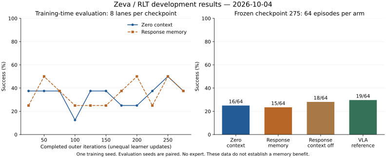

# 10-04：训练结束，记忆控制收益尚未出现

这份记录汇报昨晚双卡训练、今天的 256 回合复评和 tmux 清理。**固定响应记忆没有显示控制优势。下一步先诊断 baseline。** 实验完成快照：2026-10-04 13:26，中国标准时间。

[当前方案](zeva-rlt-implementation-2026-09-26.md) · [交互讲解](../index.html#understand) · [训练数据](../data/zeva-matched-results-2026-10-04.json) · [逐回合复评数据](../data/zeva-frozen-eval-2026-10-04.json)

## 昨晚两组任务怎样结束

训练代码固定为 `91f7bdfa`。两组在 00:42:17 达到 8 小时上限，退出码为 124。它们没有完成 1000 轮。

| 项目 | 零 context | 固定响应记忆 |
|---|---:|---:|
| 完整记录的训练轮数 | 299 | 309 |
| actor 实际更新次数 | 6954 | 5851 |
| critic 实际更新次数 | 6954 | 5851 |
| 累计记录 transition | 6547 | 5407 |
| 最后保存 checkpoint | 275 | 300 |
| 共同第 250 轮 | 4/8 | 4/8 |
| 共同第 275 轮 | 3/8 | 3/8 |

更新次数由每轮实际更新数累加。日志中的 `update_step` 是更新前计数。零 context 第 300 轮评估被预算中止，不能算作已完成结果。两组最后一次评估轮次不同，不能用 37.5% 对 50% 宣称提升。

训练标量均为有限值。更新、评估和保存链路有效，但不能由此证明收敛。同一 outer iteration 对应的 transition 和梯度更新次数不同。每组只有一个训练 seed；每次周期评估只有八个 lane。

## 今天固定模型后测到了什么

选第 275 轮，因为它是最后共同保存点。四组共享评估 seed 4001–4004，每个 seed 有 16 个 lane，每回合最多 500 个控制 tick。没有训练更新或 expert。

| 模型与输入 | 4001 | 4002 | 4003 | 4004 | 总成功数 | 成功率 |
|---|---:|---:|---:|---:|---:|---:|
| 零 context 训练模型 | 5 | 4 | 2 | 5 | 16/64 | 25.0% |
| 响应训练模型，读取历史 | 5 | 3 | 2 | 5 | 15/64 | 23.4% |
| 同一响应模型，关闭历史 | 7 | 4 | 2 | 5 | 18/64 | 28.1% |
| 全程 VLA reference | 6 | 6 | 2 | 5 | 19/64 | 29.7% |

每列分母均为 16。两组独立 smoke 各 1/2，不计入上表。四组的初始观测指纹逐 seed 一致，模型权重前后相同。reference 组实际 actor 路由为零；其他三组均执行了小 actor 的动作。

图左使用训练中的八个固定 lane；图右使用今天每组 64 回合。不能把两类样本混为一条学习曲线。图与数据均可下载。

配对结果比只看百分比更明确：响应组相对零 context 没有新增成功，丢失一次成功；相对同一模型关闭历史，丢失三次；相对 reference，丢失四次。这里的“丢失”只描述相同初态的成败差异。它不是统计显著性结论，也不证明记忆普遍有害。

## 控制链路的瓶颈在哪里

四组均有 26/64 回合到达自动接管 gate。其余 38 回合都在 reference 阶段失败。新增记忆只条件化小 actor／critic，无法在接管前直接修正 reference 的动作。

响应模型确实依赖历史。固定当前输入与 reference，遮掉历史后，归一化动作分量的平均绝对变化为 0.00454。这个统计包含所有计划预测 slot，也包含已结束 lane，不能解释为实际控制 tick 的误差或收益。

因此，下一步有两个独立问题。第一，reference 能否可靠地到达关键阶段？第二，小 actor 到达关键阶段后，是否因模仿误差或 Q 引导而偏离有效动作？增加经验 encoder 不能自动解决这两个问题。

## 代码修复与可复查记录

同一 Zeva 分支新增冻结评估入口和汇总器，最终开发提交为 `4d93ae6a`。本次有效 GPU 评估代码固定在 `5a34f04d`；之后的提交只增加汇总校验和结果说明。

| 检查 | 结果与范围 |
|---|---|
| rollout 版本为零时的动作路由 | 评估关闭训练 warmup，保留原环境 gate；避免误把 reference 当小 actor。 |
| 首次新 smoke | CPU／CUDA 的完成掩码不一致，失败退出；保留日志，不计有效正式回合。 |
| 修复后两组 smoke | 更新掩码设备处理后通过，随后完成四组正式评估。 |
| 权重与初态 | 权重不变；四组同 seed 的初始观测指纹相同。 |
| 单元测试 | 前期 61 项目标测试通过；新增汇总器后 5 项冻结评估测试通过。 |
| 汇总校验 | 拒绝未完成队列、重复 lane、初态不匹配和权重变化。 |

运行目录：`zeva_eval_20261004_124131`。每个子任务保留配置、`episode-records.json`、`route-audit.json` 和退出码。公开 JSON 保留逐回合结果与指纹，不包含内部服务器路径。

另有一项恢复缺陷已确认：第 275 轮零 context replay 索引包含 5914 条轨迹，响应组包含 4863 条，但各自仅保存 2048 个轨迹文件。本次只加载模型。完整 replay 恢复需要单独修复和验收。

## 哪些 tmux 已经清理

用户列出的 12 个旧会话均已结束或停在空闲 shell。检查了 pane 状态、子进程和连接客户端，保存终端内容及 SHA-256 后关闭。训练日志、权重和数据没有删除。

| 会话类别 | 数量 | 清理依据 |
|---|---:|---|
| `rlt_install`、`rlt_inspur_install` | 2 | 安装已结束；无活动子进程。 |
| 旧 FLARE／Zeva，含 `_v2` | 4 | 旧失败或预算退出；无活动训练。 |
| 10-03 的 `_failed_1630` | 3 | 首次启动失败及旧监控已结束。 |
| 10-03 两组正式训练与 monitor | 3 | 两组到预算，监控已退出。 |

今天首次失败的两个评估会话也已归档关闭。保留今天的 `zeva_1004_gpu0_eval`、`zeva_1004_gpu1_eval`、`zeva_1004_monitor` 供查看终端结果；三个任务均已完成。17:47 复查时，两张 GPU 已由其他账号的任务占用，没有干预这些进程。归档标识：`review_20261004_121804/tmux_archive`，本地和 NAS 各有副本。

## 下一轮实验按什么顺序做

| 顺序 | 操作 | 验收内容 |
|---|---|---|
| 1 | 在相同 gate 状态比较 actor／reference | 动作误差、Q 排序、偏移随时间的变化。 |
| 2 | 同数据训练 BC-only 与 Q+BC 零 context 头 | 同初始化、同更新数；分离模仿与 Q 引导问题。 |
| 3 | 在预先封存的新初态评估 | 记录所有指定 checkpoint；不用当前 64 回合挑最好模型再报成绩。 |
| 4 | 回到在线匹配训练 | 比较环境控制步、更新数、墙钟和无辅助成功率。 |
| 5 | baseline 通过后接固定 expert | 先验证恢复与交还，再测记忆有／无 × 纠错有／无。 |

第 2 步是离线诊断，不是在线算法收益。Stage 1B、跨重试 retain／clear、条件变化和迁移仍是待测设计。当前结果不支持直接扩大网络或续跑同样的八小时训练。

## 上游与文档更新

10-04 核查官方 [RLinf main](https://github.com/RLinf/RLinf/commit/c70606f08cdca259b8dec03d4430926b5b8fac9d)：仍为 `c70606f`。[#1623](https://github.com/RLinf/RLinf/pull/1623) replay checkpoint 修复仍开放；[#1626](https://github.com/RLinf/RLinf/pull/1626) 和 [#1645](https://github.com/RLinf/RLinf/pull/1645) 已合并。本地实验没有合入新上游变更。近期相机 PR 不影响本轮仿真。下一次开发和新 campaign 前继续核查；没有宣称启用了定时远程监控。

[当前方案](zeva-rlt-implementation-2026-09-26.md)已按短句、统一术语、表格和信息流重写。[首页](../index.html#understand)提供方法按钮和真实数据滑块。采用 [ASD-STE100 的表达原则](knowledge-base-maintenance.md#clear-writing)，不宣称中文文本或英文稿通过完整标准认证。论文 v2 保持原版本，新结果尚未纳入。
