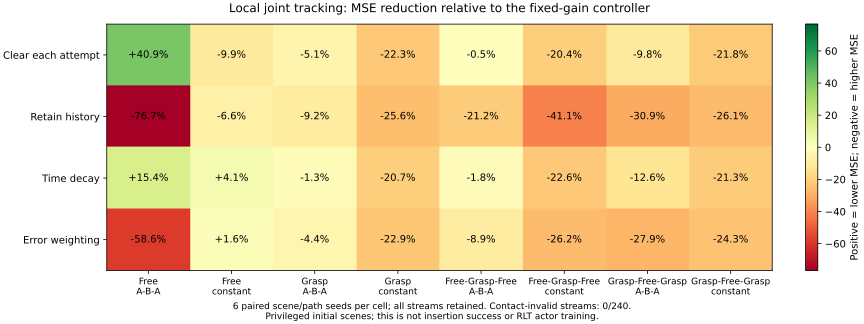

# 10-08：从响应预测转向有对照的闭环控制诊断

这份日志汇总 inspur 上已完成的 Zeva 实验：正确历史包含预测信息，但直接用历史增益修正动作，多数条件下反而增大跟踪误差。**更新：2026-10-08T21:47+08:00。前置 24 个任务及新增 240 条闭环轨迹全部完成；代码已推送 `93b1242f`。** 当前还不能宣称记忆提高了插入成功率、减少了人工纠正或实现了 physical RSI。

## 先看三个判断

1. 四组冻结复评完成，BC-only 18/64、Q+BC 19/64、reference 21/64、旧零 context 21/64。Q 项只多成功一个配对回合。四组均只有 26/64 回合到达 actor gate，前段失败仍是主要限制。
2. 固定响应公式能利用正确历史；现有神经读取明显更弱。输入尺度归一化后，神经预测器开始区分正确与错误历史，但仍没有超过强公式基线。
3. 新闭环测试中，始终保留历史在全部八种条件下均弱于固定增益。误差降权能缓解部分损害，但通常仍弱于固定基线。先诊断局部响应模型，再考虑接入 RLT。

## 已完成的控制与预测证据

| 冻结复评 | 成功/64 | 相对 reference 新增/丢失成功 |
|---|---:|---:|
| BC-only | 18 | 2 / 5 |
| Q+BC | 19 | 2 / 4 |
| reference | 21 | — |
| 旧零 context | 21 | 2 / 2 |

四组共 256 回合，权重、路由与初态审计通过。BC-only／Q+BC 同初始化、数据及预算；旧零 context 的训练历史不同。相同总成功数也可能对应不同回合，不能只看平均成功率。

| 56 对匹配状态的响应诊断 | 测试 MSE |
|---|---:|
| 训练对拟合的全局增益，无当前历史 | 9.68e-5 |
| 固定公式＋正确历史 | 2.89e-7 |
| 固定公式＋匹配错误历史 | 3.82e-4 |
| 原神经 head，无／有历史，三个 seed 均值 | 4.824e-4 / 4.832e-4 |
| 输入归一化后，无／有历史，三个 seed 均值 | 1.373e-4 / 9.668e-5 |

新旧网络容量、512 次更新和采样规则相同。归一化均值与尺度只用训练对拟合；不输入条件标签或未来后果。归一化后的错误历史误差约为 2.93e-4，说明 head 开始依赖历史。不过，有历史神经 head 仍远弱于正确历史公式，只接近无历史全局增益。归一化是在检查旧结果后提出的，因此这属于事后优化诊断，不冒充全新保留测试。

接触×刚度的 48 条响应流也全部完成。下表列出六个 seed 的整段预测误差；完整四种读取规则与逐 seed 数据见结构化证据。

| 接触阶段 | 刚度 | 保留 MSE | 误差降权 MSE |
|---|---|---:|---:|
| free_fixed | A_B_A | 8.15e-06 | 8.05e-06 |
| free_fixed | stationary | 2.76e-06 | 2.76e-06 |
| grasp_fixed | A_B_A | 3.38e-05 | 3.38e-05 |
| grasp_fixed | stationary | 2.62e-05 | 2.63e-05 |
| free_grasp_free | A_B_A | 1.9e-05 | 1.89e-05 |
| free_grasp_free | stationary | 1.11e-05 | 1.11e-05 |
| grasp_free_grasp | A_B_A | 2.5e-05 | 2.48e-05 |
| grasp_free_grasp | stationary | 1.97e-05 | 1.97e-05 |

这些差异很小，且方向并不一致。返回 A 后的前四块误差也未稳定改善。不能据此把误差降权称为可靠的经验适用性机制。

## 新实验怎样把信息变成动作

这是一个诊断控制器，不替换 RLT actor。固定、清空、保留、时间衰减、误差降权共五种方式使用相同先验增益、目标路径和初态。历史不足时回到共享先验，增益限制为 [0.25, 2]，命令限幅 ±0.08。当前动作完成后才更新记忆；控制器不读取刚度或接触标签。

新 seed 为 58101–58106，工程 smoke 使用独立 seed 58001。阶段固定／变化各有四种接触×刚度组合、五种方法、六个 seed，各 120 条流；每条流包括三个尝试、780 个真实控制步，总预算 187,200 步。两组 smoke 各 20 条流通过，没有接触失效。

| 完整闭环诊断 | 快照状态 | 响应流 |
|---|---|---:|
| 阶段固定 | 已完成 | 120/120 |
| 阶段变化 | 已完成 | 120/120 |

两组各执行 93,600 个环境控制步，合计 187,200 步；240 条流均通过已定义的接触检查。各方法的初始状态配对通过。物理仿真主要使用 CPU，GPU 负责场景资源；任务已完成并释放资源。报告保留全部轨迹，未筛除失败。

## 闭环结果：预测信息还没有变成控制收益

图中数值为跟踪 MSE 相对固定增益的降幅，正值表示改善，负值表示变差。每格包含六个相同初态和目标路径的 seed，属于开发诊断，没有做显著性结论。`free` 指空载，`grasp` 指抓持；`fixed` 指接触阶段不变，`stationary` 指刚度不变。

| 代表条件 | 每次尝试清空 | 始终保留 | 时间衰减 | 后果误差降权 |
|---|---:|---:|---:|---:|
| 空载，刚度 A→B→A | +40.9% | −76.7% | +15.4% | −58.6% |
| 抓持，刚度不变 | −22.3% | −25.6% | −20.7% | −22.9% |
| 空载→抓持→空载，刚度不变 | −20.4% | −41.1% | −22.6% | −26.2% |

完整八种条件在图和结构化结果中保留。始终保留在八种条件下全部变差。清空在空载刚度变化时有效，但不能推广到抓持。所有包含抓持的条件中，四种自适应方式均未超过固定基线。接触检查通过只能排除本协议记录的接触失效，不能证明接触控制质量完全相同。

这个反例针对的是“逐关节响应增益求逆＋当前记忆规则”，不能推导出历史记忆无用。历史可以预测位移，也可能因为忽略持续运动、接触约束或关节耦合而产生错误动作。上述原因仍是待检验假设。

初态使用特权抓持构造，目标是局部关节跟踪。因此本轮既不等于完整插入评估，也不构成减少人工纠正或 physical RSI 的证据。

## 下一步先解释失败，再增加模型

1. 在已有轨迹上检查：动作较小时是否仍有位移，残差是否依赖前一块响应，抓持前后是否出现跨关节耦合。先做诊断图和配对误差分解，不把相关性当成因果。
2. 若存在稳定证据，用新采集的零命令／正负小命令对照，区分漂移、延迟和真正的动作响应。新 probe 需记录块起点速度，按场景划分训练与验证。
3. 比较共享固定增益、带偏置的一阶响应、含速度的局部响应。只有新的保留条件和闭环均获益，才做带 gate 的 RLT 对照；Stage 1B 与正式经验适用性学习暂不推进。

## 工程与复现

- [代码 93b1242f](https://github.com/nkd-lkz/UPT_dev/commit/93b1242f1a5c6b44472844b16bcfe5aa712f634f)：输入尺度诊断、过去响应驱动的有界控制器、配对初态与真实步数审计。
- 60 项 CPU 测试通过；Ruff 通过；中英文 Sphinx 构建均零警告。全仓 RST 扫描的既有告警另留记录。
- [可执行协议](https://github.com/nkd-lkz/UPT_dev/blob/research/rlt-zeva-interaction-memory/experiments/maniskill_rlt/CONTACT_FACTORIAL_2026-10-08.zh-CN.md)与[结构化结果](evidence/zeva-results-2026-10-08.json)。
- 再次核查官方 RLinf：main 仍为 `0067f7d5`，replay 修复 #1623 已合并，#1658 仍开放。本轮固定版本不变，未恢复旧 replay。

---

## 20:04 的启动快照已归档

[原始发布快照](evidence/zeva-campaign-2026-10-08.json)保留当时的 64/256 回合和初态哈希。本页以上内容为后续更新，不将旧“运行中”表述当作实时状态。另一台服务器的 LIBERO／planner 与 VR 进展保留在首页各自条目中，不与本轮混报。
