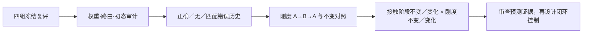

# 10-08：Zeva 冻结复评重启，分开检查接触与物理条件

这份日志说明 inspur 服务器本轮实际启动的工作、验收条件和结果边界。**快照：2026-10-08T20:04+08:00；已验收 64/256 回合。** 网站是发布时快照；服务器后台状态文件每分钟更新。另一台服务器的 LIBERO／planner 结果保留在各自记录中，不与本轮合并。

## 已经执行到哪里

| 项目 | 状态 | 能说明什么 |
|---|---|---|
| 10-06 旧队列 | 等待超时，未完成 GPU 作业 | 不能当作已有复评结果 |
| 10-08 四组冻结复评 | GPU 0 跑 BC-only／reference；GPU 1 跑 Q+BC／旧零 context | 每组 4 个 seed × 16 回合，共 256 回合 |
| 接触阶段工程 smoke | 单 seed、阶段固定、4 条流通过 | 初态构造和接触审计可运行；不是方法收益 |
| 开发验证 | 56 项 CPU 测试通过，中英文 Sphinx 零警告 | 既有 RST 扫描告警另留日志，未称全仓无告警 |
| Git | 已推送 `baa1f194` | 冻结评估代码仍为 `7335f2f4`，运行中不合并上游 |

两张卡启动前短暂空闲，随后被其他用户占用；队列等到再次空闲才执行。首个 seed 的 launcher 均正常退出，验收器却在错误的子目录查找文件。修复支持真实输出布局，补测后重新审计并复用已完成结果，没有重跑来挑选成绩。

当前已验收结果如下。**中间 seed 不判断算法优劣；只有 BC-only 与 Q+BC 的新 head 训练预算匹配。**

| 组 | seed | 成功/回合 | 审计 |
|---|---:|---:|---|
| bc_only | 4101 | 6/16 | 权重不变，初态已记录 |
| bc_only | 4102 | 2/16 | 权重不变，初态已记录 |
| q_bc | 4101 | 6/16 | 权重不变，初态已记录 |
| q_bc | 4102 | 3/16 | 权重不变，初态已记录 |

## 后台怎样继续

审计失败会阻断后续任务，保留日志。不会自动降低阈值，也不会直接启动 Stage 1B。基础复评与响应探针每卡实际运行上限 12 小时，接触补充每卡上限 2 小时；等待截止 10-10 07:46 CST。完成就释放 GPU，这些预算不是必须占满的时长。

历史探针采集 56 对相同当前状态、不同执行条件的记录。历史输入只来自已完成动作。正确历史、无历史和匹配错误历史比较保留测试对的响应误差。三个初始化／采样 seed 各训练 512 次同容量预测 head；它不是正式 Stage 2 actor。

## 接触阶段与物理变化怎样分开

| 接触序列 | 刚度不变 | 刚度变化 |
|---|---|---|
| 无接触→无接触→无接触 | 1000→1000→1000 | 1000→250→1000 |
| 抓持→抓持→抓持 | 1000→1000→1000 | 1000→250→1000 |
| 无接触→抓持→无接触 | 1000→1000→1000 | 1000→250→1000 |
| 抓持→无接触→抓持 | 1000→1000→1000 | 1000→250→1000 |

六个 seed 在各组合中重复同一组命令。接触阶段用两指接触力和实际抓持判定审计，阶段标签和刚度标签不输入预测器。抓持初态通过放置物体和手指后进行物理稳定得到，属于特权诊断构造，不是机器人完成抓取。阶段固定／变化各先运行 smoke，通过后各执行 24 条完整响应流。

四种读取方式都保留：清空、始终保留、时间衰减、后果误差降权。先预测，再加入当前执行后果。滑落、意外接触和不完整记录不能算有效阶段对照。当前只验证手指–peg 接触，没有证明插入接触阶段或完整任务收益。

## 哪些结论仍然不能说

10-04 冻结复评仍是零 context 16/64、响应记忆 15/64，尚无记忆收益。合成 A→B→A 返回 A 后，误差降权 MSE 0.000696，高于简单保留的 0.000389。保留这些反例。

下一步判断依次是：正确历史是否含额外信息；旧经验管理是否优于简单保留；这种收益能否进入闭环控制。通过后再讨论 Stage 1B、经验适用性学习和有／无固定 expert 的纠错预算实验。目前不能宣称减少人工干预、提高最终成功率或实现 physical RSI。

## 代码、上游与原始证据

- [本轮提交 baa1f194](https://github.com/nkd-lkz/UPT_dev/commit/baa1f194375599742acdbb9f287af737041273cb)：接触组合、接触审计、只读跨 campaign 依赖、真实评估路径验收。
- [中英文可执行协议](https://github.com/nkd-lkz/UPT_dev/blob/research/rlt-zeva-interaction-memory/experiments/maniskill_rlt/CONTACT_FACTORIAL_2026-10-08.zh-CN.md)。
- [结构化证据快照](evidence/zeva-campaign-2026-10-08.json)：运行数量、初态哈希、冻结权重与 manifest 哈希。
- 官方 [RLinf main 0067f7d5](https://github.com/RLinf/RLinf/commit/0067f7d5ce525c18bda439ed8dbb638abafd6a06) 已包含 [replay 修复 #1623](https://github.com/RLinf/RLinf/pull/1623)；[π0.5 文档 #1658](https://github.com/RLinf/RLinf/pull/1658) 仍开放。恢复在线训练前另行验收 replay 保存／加载，冻结复评只恢复模型。
