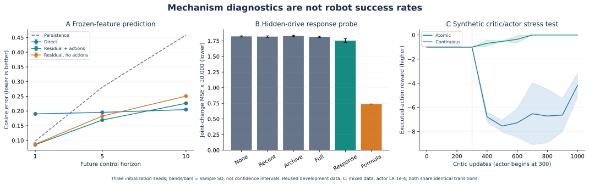

# 三分支审查：代码、42 组小实验与下一步门槛

本轮审查修复了 FLARE 的掩码梯度问题，并为 Zeva、Jev 补齐可解释且可执行的对照。三个分支保持隔离；baseline 与 VR 未改动。运行目录为 `three_branch_audit_20260930_1247`，结构化结果见 [JSON](../data/three-branch-audit-2026-09-30.json)，原始权重与日志留在服务器 NAS 的 `research/` 下。测试阶段使用开发工作树，因此 manifest 同时记录基准 commit、diff 哈希与源文件哈希，而不是冒称都运行于最终提交。

本轮代码分别提交并推送为 [FLARE `3ca6f246`](https://github.com/nkd-lkz/UPT_dev/commit/3ca6f246)、[Zeva `547d634e`](https://github.com/nkd-lkz/UPT_dev/commit/547d634e)、[Jev `6c5cf66d`](https://github.com/nkd-lkz/UPT_dev/commit/6c5cf66d)。三个工作树均保持独立，没有合并回 baseline。各分支 `experiments/maniskill_rlt/AUDIT_2026-09-30{,.zh-CN}.md` 包含中英文复查命令。

## 下午续作：预先固定实验矩阵与人工介入入口

以下是后续开发，不覆盖上面 42 次诊断的记录。新提交为 FLARE `d8ec52ad`、Zeva `80fbec73`、Jev `ef9b2478`、VR `12260ef5`。GPU 0/1 与正式 baseline 分支保持不动。

| 分支 | 本次新增实现 | 预先固定的诊断 |
| --- | --- | --- |
| FLARE | 置零手臂命令、仅逆序有效动作前缀；防止短跨度混入未来动作 | 原 3 种预测器，250/1000 updates，新增种子；共 27 次拟合 |
| Zeva | 固定经验响应 + 零初始化学习修正，允许 validation 选第 0 步 | 6 个读取器 × 6 seeds；共 36 次拟合 |
| Jev | 所选动作 Q 偏差/绝对误差/双 Q 分歧；配对 BC 与参考数据锚定 | BC=0.1/7/70 × reference_fraction=0/0.25 × 3 seeds × 2 actor；共 36 次拟合 |
| VR | step 2000、5000-update 单环境 pilot、发布 BC 门槛、接管统计、完整恢复、共享 GPU 2 锁 | CPU RPC/control/learner：34 passed、2 hardware skips；等待操作者 Windows/PICO 验收 |

三个研究分支本次 CPU 回归为 194/202/205 passed，均有 1 项可选 skip、1 项已知 baseline VideoMetadata 失败排除；FLARE 本次命令仅 models/data，与先前额外 worker case 的数量不可直接相减。队列组件 5 项测试通过。图与摘要沿用上面的方案页，所有“持续成长”表述仍是待验证目标。

`research/scripts/experiment_queue.py` 声明 11 组、99 次小模型拟合，最多 12 小时；每组最多一小时。CPU 任务使用单线程，只有缓存特征上的小预测器共享 GPU 2，沿用至少 8 GiB 余量和 4% PyTorch allocator 上限。任何失败/超时停止后续组，只终止本队列创建的 child group，不停止其他用户或 baseline 作业。完成预定矩阵即结束，不为填满时间重复计算。它执行预设实验，不代表后台模型会持续自行改代码。

Jev 完整在线队列仍等待 GPU 2 空闲；本矩阵不绕过其资源限制。数据仍为已查看的开发集，更多种子不等于新的独立任务。新增论文与借鉴范围见[前沿清单](literature/frontier-rlt-2026-09-30.md)。

人工接管可以从独立 VR 分支启动：

```bash
cd /home/luokz/rlinf_rlt/UPT_vr_dev
bash run_rlt_vr_hil_pilot.sh check
tmux new-session -s rlt_vr_hil 'bash run_rlt_vr_hil_pilot.sh run; exec bash'
```

Windows 继续通过 SSH tunnel 8775 和 `client --online` 接入；启动前按[中英文操作指南](https://github.com/nkd-lkz/UPT_dev/blob/feature/rlt-pico-vr-intervention/experiments/maniskill_rlt/VR_ONLINE.zh-CN.md)输入相同口令。**该入口是 baseline RLT 的单环境单步变体，不是给正在运行的 64 环境、10 步 head 插入接管。** GPU 2 被占用时会拒绝启动，不能保证操作者回来时资源已空闲。

## 原审查：先区分实现通过与能力收益

| 分支 | 本轮代码变化 | 验证 |
| --- | --- | --- |
| FLARE | 在归一化和非线性损失前屏蔽无效未来标签／动作；增加同结构无动作输入消融 | 194 passed；无效 NaN 标签的旧实现可复现梯度污染，修复后有限 |
| Zeva | 新增可选 `reader_type=response`，共享真实执行响应公式；检查控制器尺度；兼容旧 checkpoint 默认配置 | 201 passed；时序、terminal/reset、快照、梯度归属、配置和新旧读取器检查 |
| Jev | 新增同幅度连续 residual 对照及 GPU 2 pilot 配置；测试数据覆盖和 actor 热身敏感性 | 204 passed；实际 RLT actor/critic loss 路径、梯度、范围、夹爪与恢复检查 |

上述每组另有 1 skipped、1 deselected。未筛选的第一次回归在三分支都遇到 `VideoMetadata(...frames_indices=...)` 的依赖接口错误；已在未修改 baseline 单独复现，明确排除该无关测试，没有修改共享依赖掩盖失败。599 是三个套件通过数量之和，包含共用测试，**不是 599 个独立新增测试**。

修改文件的 Ruff、格式与 shell 语法检查通过，FLARE 的英文／中文 Sphinx 构建通过。全仓 RST 额外静态扫描仍发现 61 个排版 warning 和 26 个名称引用项；相关 `docs/` 与 baseline 相同，本轮未修改，不能将全仓文档说成零告警。新增 Markdown 另做命令、相对链接和 EN/ZH 语义核对。

三个分支还分别通过物理 GPU 2 的单 rank、fp32 FSDP 测试：各 20 次 critic 和 actor 更新、权重恢复、确定性动作一致性。world size=1 会使用 `NO_SHARD`；这不验证多卡梯度通信、Ray、ManiSkill 或完整 VLA rollout。FLARE 缓存实验约 605 秒，PyTorch 峰值 allocated 58.1 MiB、reserved 64 MiB；CUDA context 等额外开销不包含在此，采样 `nvidia-smi` 观察到该进程约 576 MiB。只限制并使用 GPU 2，不对其他进程发信号，也不声称共享计算没有吞吐影响。

## FLARE：动作有信息，但并非所有 horizon 都该选同一种预测器

固定 Stage 1 step 2000 特征坐标，9 个训练 episode、3 个验证 episode、12 个开发测试 episode；3 个初始化种子，3 种网络，每种 1000 个优化更新。验证选择 checkpoint；测试 episode 与训练／验证不重叠，但这个测试集以前已被查看，**不是未使用过的最终测试集**。

| 平均 cosine error，越低越好 | h=1 | h=5 | h=10 |
| --- | ---: | ---: | ---: |
| 当前状态保持 | 0.0978 | 0.2810 | 0.4587 |
| 直接预测 | 0.1901 | 0.1954 | **0.2049** |
| 增量预测＋动作 | **0.0854** | **0.1694** | 0.2263 |
| 同结构增量预测，不输入动作 | 0.0871 | 0.1828 | 0.2508 |

增量模型加入动作后比无动作对照更准；打乱动作后误差约为 0.1017／0.2537／0.3836，说明预测依赖动作。不过动作打乱不等于真实物理反事实试验，也可能引入离分布组合。1000 更新时直接预测在 h=10 更好，不能把此前 300 更新的结果概括成“增量预测总是最好”。后续 checkpoint 选择应由预注册验证指标决定，不根据测试集反复挑赢家。

## Zeva：历史确有信息，当前神经读取仍未充分利用

使用已有真实 CPU 物理轨迹：56 组成对场景／命令种子，每组隐藏 PD 刚度有两种条件，各 120 控制步。按 pair 分为 32／8／16 组，成对条件不跨划分；隐藏参数只用于实验组织，不输入模型。5 个读取条件 × 3 seeds × 1000 更新，另有固定公式的无训练评测。

| 条件 | 测试关节变化 MSE |
| --- | ---: |
| 无记忆 | 0.00018211 |
| 近期历史 | 0.00018176 |
| 仅检索 archive | 0.00018267 |
| 完整神经读取 | 0.00018143 |
| 显式响应特征＋相同预测头 | 0.00017533 |
| 固定经验响应公式 | **0.00007389** |

新读取器把“已发出多少关节命令、实际动了多少”计算成每关节 slope 与 excitation support，并补零到原 64 维接口。它不新增可学习参数，默认仍是原 attention reader。最后一行直接用经验响应预测变化，不经过神经预测头，属于有结构先验的强对照，不是同容量模型。该任务接近局部响应辨识；它不证明接触理解、抓取成功或跨任务迁移。下一步优先解释为什么预测头仍损失这些信息，而不是再扩大 attention。

## Jev：有限候选能限制 critic 外推，但当前对照还不是论文结果

对两个 actor 使用相同的 2048 条合成 transition 和独立 256 个评估 context，每个条件 3 seeds、1000 critic 更新。不是机器人仿真：context 给出应修正的符号，reward 是已执行动作的解析二次误差。选择器和连续 actor 都不读取候选正确答案标签，critic 只读取采样动作的 reward。

| 数据／优化设置 | 离散最终平均 reward | 连续最终平均 reward，三 seeds |
| --- | ---: | --- |
| 仅候选动作数据，actor 从头更新 | 0 | −8.03、−8.25、−8.11 |
| 一半候选＋一半连续扰动 | 0 | −8.03、−8.25、−8.11 |
| 混合数据；critic 先训练 300 更新；actor LR 降为 1e-4 | 0 | −3.62、−3.57、−5.34 |

0 是该合成任务最优 reward，不是 100% 机器人成功率。连续 actor 的解析监督拟合单测通过，说明它能够表示并学习范围内修正；这里的退化指向 learned critic 引导下的优化／外推问题。后两组是看到第一组结果后追加的诊断，完整保留而不当成预注册确认实验。连续模型能同时改多个关节和不同时间步，假设空间更大；等幅度不等于相同能力或相同问题难度。要证明离散选择优越，仍需公平调参预算与真实在线反馈。



图中误差线／阴影为三个初始化的样本标准差，不是统计置信区间。重复使用的数据也不提供新的独立任务证据。

## 审查范围与没有完成的部分

检查了配置 → policy factory → actor/critic loss → 已执行动作 replay → optimizer 归属 → target/checkpoint 路径；新增行为默认关闭。FLARE target detach、Zeva 历史快照和 reset 隔离、Jev 离散梯度与真实动作 critic 均有回归覆盖。没有更改 baseline 奖励、专家接管、训练环境数或 GPU 0/1 placement。

仍未证明：新增输入改善闭环成功；多卡训练正确；共享 GPU 下完整 VLA/ManiSkill 吞吐；接触状态可由关节轨迹充分辨识；跨物理条件／跨任务迁移；减少人工接管。没有新增真机实验。

## 下一步按证据推进

1. Jev 保留空闲等待队列，完整在线作业仍需通过资源检查；不能把本轮小模型 GPU 共存许可转化成无保护的大作业共存。
2. FLARE 重做匹配 FSDP、BC 热身和 reference 跟随验证，再做至少 20 个固定初态的 baseline／world 对照。当前辅助 loss 下降不替代这一门槛。
3. Zeva 用固定响应公式作为必须超过的 baseline；先验证局部预测与不确定支持度，再接入相同 learner。保持隐藏物理条件不作为输入。
4. 新的机器人测试集应在方法选择后封存，比较成功率、干预次数／时长、重复失败、交互步数、时延和旧任务保持。

共同建议：先回答一个小问题，再决定是否组合三分支。可用于分享的原理与摘要见 [方案讲解](three-branch-research-plan-2026-09-30.md)，邻近工作与新颖性边界见 [调研](literature/frontier-rlt-2026-09-30.md)。

## 等待队列交接

旧等待器固定于修改前 commit，继续使用会在启动前拒绝新工作树，因此只停止并替换了这个尚未运行训练的等待器。旧日志完整保留。新队列在 tmux `rlt_jev_auto_gpu2` 中固定于 `6c5cf66d`，输出目录为 NAS `runs/atomic_experiments/jev_20260930_audit_6c5cf66d`，等待预算 24 小时：GPU 2 连续两次空闲才执行 2-step smoke，通过有限 loss、真实 learner update 和 checkpoint 检查后才运行 20-step pilot。任一失败停止后续阶段；不会终止现有 GPU 作业。队列状态必须看 `status.json` 和日志，本报告中的“等待”不是完成训练。
