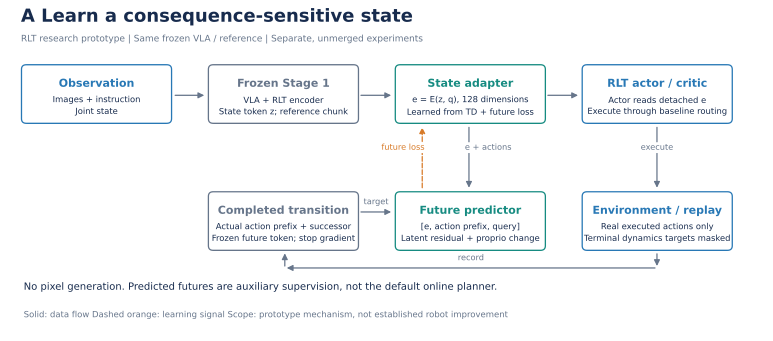
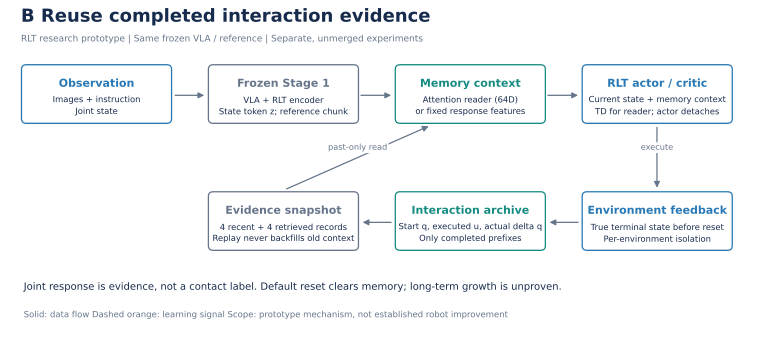
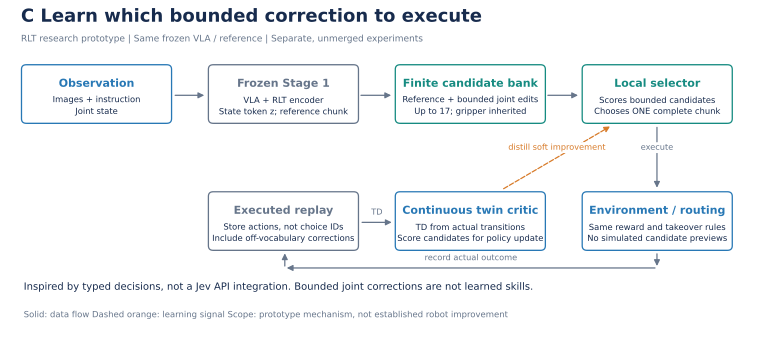

# 从“发出动作”到“利用执行经验”：三条可验证的 RLT 研究线

这份分享稿解释三个原型如何分别学习动作后果、读取交互经验和限制决策范围，并明确它们距离真机持续成长还缺哪些证据。材料形成于代码修改和小实验之后；摘要是**研究方案摘要**，不是已完成论文的成果宣称。实际结果、负结果和测试范围见 [审查记录](three-branch-audit-2026-09-30.md)。

## 共同起点：机器人发出了命令，不等于发生了预期运动

RLT 把冻结 VLA 的大规模表征压缩为 RL token，小 actor/critic 利用它和关节状态、参考动作学习。这个结构降低了在线训练成本，但当前观测不一定揭示“刚才为什么没动”“当前控制响应是否变化”。我们的切入口是把执行证据接到小网络，而不是立即微调整个 VLA。

本项目先把 physical 操作性地定义为：**在给定当前观察、身体与控制接口时，实际动作如何改变后续可观测状态。** 关节命令、实际关节变化和未来表征是可测代理量；它们不是牛顿定律、接触真值、摩擦系数或安全证书。未观测的滑移与受力不能凭网络名字补出来。

三条线分别回答：这次会发生什么？过去类似动作发生了什么？在受限选择中哪一步更合适？它们现在独立，不是一张已经运行的统一系统。

| 分享时对应的核心代码 | 数据到更新的入口 |
| --- | --- |
| FLARE | [状态编码／未来损失](https://github.com/nkd-lkz/UPT_dev/blob/3ca6f246/rlinf/models/embodiment/modules/rlt_latent_world.py)、[Stage 2 loss 接线](https://github.com/nkd-lkz/UPT_dev/blob/3ca6f246/rlinf/workers/actor/fsdp_rlt_ac_policy_worker.py) |
| Zeva | [记录与快照](https://github.com/nkd-lkz/UPT_dev/blob/547d634e/rlinf/algorithms/rlt/interaction_memory.py)、[attention／响应读取](https://github.com/nkd-lkz/UPT_dev/blob/547d634e/rlinf/models/embodiment/modules/rlt_memory_encoder.py) |
| Jev | [候选库](https://github.com/nkd-lkz/UPT_dev/blob/6c5cf66d/rlinf/models/embodiment/modules/rlt_action_candidates.py)、[本地选择器](https://github.com/nkd-lkz/UPT_dev/blob/6c5cf66d/rlinf/models/embodiment/mlp_policy/rlt_atomic_policy.py)、[连续 residual 对照](https://github.com/nkd-lkz/UPT_dev/blob/6c5cf66d/rlinf/models/embodiment/mlp_policy/rlt_bounded_policy.py) |

## 一、FLARE 启发：让状态表征接受执行后果监督

### 研究方案摘要

面向冻结大模型上的低成本机器人强化学习，我们研究可在线更新的执行后果表征。系统保留 RLT 的冻结视觉语言坐标，以已完成动作及其后继观测训练轻量动作条件化预测器，将其状态编码提供给小 actor/critic。通过状态保持、无动作输入和直接／增量预测对照，检验表示是否包含动作相关的变化，而非仅记忆场景时间相关性。现有开发实验支持动作输入的预测价值，尚待验证其在线控制收益及对人工纠正的影响。

### 一条真实数据怎样进入网络

当前 RL token 为 `z_t`，本体观测为 `q_t`。小 encoder 得到 `e_t=E(z_t,q_t)`。对真实执行的动作前缀，Transformer 读取 `[e_t,a_t,...,a_(t+h-1),query_h]`，输出未来 latent 和 proprio 变化。这里的 proprio 已经过 VLA 输入变换，不应把预测数值直接解释为原始弧度或力；下节 Zeva 记录的则是环境原始关节位置。增量形式是在归一化当前 latent 上加预测修正，不生成未来画面。

未来目标来自真实后继观测，经固定 Stage 1 encoder 计算并 detach。Stage 1B 在缓存上训练；Stage 2 在真实 replay 上以 `L_TD + λ L_future` 更新 critic 和新增编码／预测模块。actor 读取的 `e_t` detach，仍由 Q＋BC 更新。VLA 不随这条未来损失更新。无效 terminal 目标和 padding 必须在非线性运算前屏蔽，不能只在最终标量 loss 上乘零。

借鉴 [FLARE](https://research.nvidia.com/labs/gear/flare/) 的是未来 latent 对齐，不是原论文内部联合动作生成的完整实现。当前 actor 主要读取新增状态编码，并不逐个候选调用预测器做 planning。要转向预测式 critic，[Imagine-RL](https://arxiv.org/abs/2609.24033) 已是必须认真比较的近邻。

**最重要的否证条件：**若无动作模型也一样好，不能称动作后果学习；若预测更准但相同预算的闭环没有收益，应停止把预测误差当作控制价值。当前 h=10 的直接预测已优于增量形式，保留这个反例。

## 二、Zeva 启发：将命令与实际响应保留为可查询证据

### 研究方案摘要

我们研究冻结感知模型下的可审计交互记忆：仅记录已经完成的动作前缀、起始关节状态与真实状态变化，在下一次决策读取有限近期和历史记录。记忆快照随 transition 保存，避免在线更新时未来经验回填过去。除神经 attention reader 外，加入参数无关的局部响应统计，区分“历史是否有信息”与“学习器是否用好了信息”。开发诊断表明简单响应公式优于现有学习读取器，因此后续首先研究可靠读取、条件变化后的遗忘与迁移，而不预先宣称通用物理知识。

### 记住什么，什么时候才能使用

每条记录包括起始 `q`、实际执行命令、结束 `q` 与开始的差、有效 tick、结束标志。默认保存近期 4 条、最多 32 条 archive，再按关节位置检索 4 条非重复旧记录。没有视觉历史、力或触觉；关节接近也不保证物体与接触条件相同。

新对照对每个手臂关节计算：

`u_i = 0.1 × sum(executed delta commands)`

`response = sum(u_i × delta_q_i) / (sum(u_i²) + 1e-4)`

同时提供 `support = sum(u_i²)/(sum(u_i²)+1e-4)`，避免把没有有效动作激励的比值当成可信响应。slope 截断到 [-2,2]，7 个 slope 与 7 个 support 补零为 64 维。0.1 来自已验证控制器尺度；动作语义改变时必须重新校验。

这个机制继承 [Zeva](https://arxiv.org/abs/2608.30880v2) “动作＋引发的变化”的思路，但不是其完整视觉因果模型。默认 reset 清空记忆，只有明确验证同一物理实例的重试才可选择保留 archive；目前不能称跨任务永久知识库。经验响应也可能混合刚度、接触、饱和和滞后影响，不能单凭它识别失败原因。

**最重要的否证条件：**同容量短历史或固定公式达到相同效果时，复杂检索网络没有独立贡献；若只在同一个物体或同一控制器上有效，不能声称可迁移经验。

### 实验推动的一次简化：有用经验不应被预测头抹掉

下午续作在诊断头中先保留经验公式，再学习它的误差。第一轮降低了整体误差，却破坏了历史充分时的好估计，于是追加了基于命令激励支持度的缩放：

`predicted_delta_q[j] = empirical_gain[j] * query_command[j] + (1 - support[j]) * learned_correction[j]`

历史不足时，学习头提供一个从离线样本学来的补偿；历史有充分动作激励时，更多保留当前实例已经表现出的响应。6 种子开发实验将总体 MSE 从固定公式的 `7.3889e-5` 降到 `2.4417e-5`，后期 MSE 约保持在固定公式水平。实现与边界在 [诊断头](https://github.com/nkd-lkz/UPT_dev/blob/c8f72a0e/toolkits/rlt/probe_memory_dynamics.py)和[续作结果](three-branch-audit-2026-09-30.md)。这不是生产 actor 的闭环收益，也不是新的统计置信度或物理定律。

它让下一个科研问题更明确：**如果接触或控制条件突然变化，什么时候应该放弃高支持度的旧经验？** 当前数据中的每回合条件固定，不能回答这个问题。下一步需要真实变化点轨迹，比较清空、滑动窗口、固定衰减与误差驱动更新；不能把本次同分布改善包装成持续成长。[DRAM](https://arxiv.org/html/2609.32453v2) 已研究用关联预测残差更新定长记忆，因此未来贡献必须落在执行证据、变化条件和实际控制收益，而非仅增加 memory token。

## 三、Jev 启发：把自由动作优化变成有限、可审计的改进选择

### 研究方案摘要

我们研究参考动作附近的有限选择是否比自由连续修正更容易利用有限交互数据。系统从冻结 VLA 的动作 chunk 构建幅度受限、去重的候选，由本地小网络选择一个完整 chunk；连续 twin critic 始终学习真实执行动作，包括不在候选集中的人工修正。通过精确候选期望与 soft improvement 分布拟合训练选择器，并加入同幅度连续 residual 对照。合成诊断提示有限支持可能缓解 critic 外推引起的控制退化；真实机器人任务、调参公平性与灵活性损失仍待检验。

### 选择器不是动作平均器，也不是语言模型

候选由 reference、衰减／制动修正和单关节正负修正组成，最多 17 个；夹爪继承 reference。实际执行只选择一个完整候选。不能把“几个互相抵消的候选概率平均后接近正确动作”算成成功。

critic 用真实执行动作训练；下一状态 target 对候选概率精确求和。actor 的训练目标先用 Q、BC 距离与 reference prior 构造 detached soft improvement 分布，再拟合该分布。它借鉴 [Jev](https://typesafe.ai/blog/introducing-system-one-models-and-jev) 的有限输出接口，但数学上与已有策略改进／分布拟合方法相关，不调用付费 API，不读取模拟器预演或几何真值。

新连续对照输出 `clip(reference + radius × tanh(residual), -1, 1)`，同样固定夹爪，确定性初始输出严格等于 reference。相同幅度下它可以同时改变多个关节与各时间步，因此能力集合并不等同。两者的探索、优化和调参预算都应报告。机器人任务中，候选覆盖不足、夹爪错误无法修复或 chunk 内需要换方向都可能使离散方法失败。

**最重要的否证条件：**若仅限制连续动作幅度就得到相同收益，贡献来自探索约束而非离散选择；若有限动作无法覆盖有效恢复路径，必须承认上限，不能把改名“原子技能”当作解决方案。

## 怎样走向真机与持续成长

更有研究价值的候选方向是：**用已完成交互估计局部执行响应及其支持度，判断经验何时能帮助下一次修正、何时应该放弃旧经验。** 这仍是设想；它属于自适应控制、系统辨识和记忆 policy 的交叉问题，尚未建立独占新颖性。[前沿调研](literature/frontier-rlt-2026-09-30.md)列出的 UniMPA、StateMem、ForceRFT 等必须进入比较。[F4R](https://arxiv.org/abs/2609.35575v2) 已研究失败驱动的 real-to-sim-to-real 改进闭环，因此我们的区别必须落在轻量交互证据如何改变下一次控制，而不是仅宣称有再训练循环。

建议四级验收，而不是直接开始大训练：

1. **机制可测。** 改变隐藏控制响应／物理条件，但不把变化标签给模型；验证预测、记忆或动作选择真正有用。
2. **闭环有效。** 同一固定 VLA、奖励、路由、干预条件、初态、交互步数，比较 baseline、简单公式、复杂模块。以独立 episode 而非视频帧计算不确定性。
3. **积累可复用。** 将经验量设为 0／少／多，分别冻结参数、冻结记忆、同时更新；在后续独立尝试测试，区分靠新训练还是靠旧记忆。物理条件变化时测试错误记忆造成的负迁移。
4. **真机可接受。** 由可观测反馈获得输入，按硬件控制频率与时间戳对齐；保留速度／力／工作空间约束、人工急停和接管。报告自主成功、人工接管次数与时长、重复失败、延迟、遗忘和总交互成本。安全限幅不等于安全证明。

可向同事简述为：**我们不把“存下轨迹”叫成长。只有过去经历通过一个明确可审计的接口，改善下一次独立操作，并且没有以遗忘或更多人工帮助为代价，才算积累了有用经验。**

## 分享与出图

三张原理图及一张结果图均提供 SVG、PDF 和 240 dpi PNG，源程序为 [publish_three_branch_audit.py](scripts/publish_three_branch_audit.py)。图采用可编辑矢量文字、统一配色与独立结果标注；可作为论文方法图初稿，但方法新颖性和实验充分性尚不达到已完成论文的证据标准。共享 GPU 守卫见 [shared_gpu_audit.py](scripts/shared_gpu_audit.py)，单 rank 集成诊断见 [fsdp_modules.py](scripts/fsdp_modules.py)。

矢量 PDF 下载：[FLARE](figures/three-branch-audit-2026-09-30/flare-architecture.pdf)、[Zeva](figures/three-branch-audit-2026-09-30/zeva-architecture.pdf)、[Jev](figures/three-branch-audit-2026-09-30/jev-architecture.pdf)、[真实诊断结果](figures/three-branch-audit-2026-09-30/diagnostic-results.pdf)。
